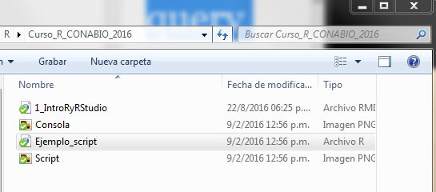

### ¿Qué es R?
* R es un lenguaje de programación y un ambiente de cómputo estadístico
* R es software libre (no dice qué puedes o no hacer con el software), de código abierto (todo el código de R se puede inspeccionar - y se inspecciona).
* Cuando instalamos R, instala la base de R. Mucha de la funcionalidad adicional está en **paquetes** que la comunidad crea.

### ¿Por qué R?
* R funciona en casi todas las plataformas (Mac, Windows, Linux e incluso en Playstation 3).
* R es un lenguaje de programación completo, permite desarrollo de DSLs (funciones muy específicas)
* R promueve la investigación reproducible: no sólo de análisis sino de cómo se hicieron las figuras.
* R está actualizado gracias a que tiene una activa comunidad. Solo en CRAN hay cerca de 8000 paquetes (funcionalidad adicional de R creadas creada por la 
comunidad).
* R se puede combinar con herramientas bioinformáticas y formatos de datos procesados (e.g. plink, vcf, etc) para realizar análisis y figuras.
* R tiene capacidades gráficas muy sofisticadas.
* R es popular como herramienta estadística ([la guerra del software](http://datacamp.wpengine.com/wp-content/uploads/2014/05/infograph.png))


### Descargar R y RStudio
Para comenzar se debe descargar [R](https://cran.r-project.org), esta descarga incluye R básico y un editor de textos para escribir código. Después de descargar R se recomienda descargar [RStudio](https://www.rstudio.com/products/rstudio/download/) (gratis y libre).

**RStudio** es un ambiente de desarrollo integrado para R: incluye una consola, un editor de texto y un conjunto de herramientas para administrar el espacio de trabajo cuando se  utiliza R. 


### ¿Cómo entender R?
* Hay una sesión de R corriendo. La consola de R es la interfaz entre R y nosotros. 
* En la sesión hay objetos. Todo en R es un objeto: vectores, tablas,  funciones, etc.
* Operamos aplicando funciones a los objetos y creando nuevos objetos.

##### La consola
Es una ventana que nos permite comunicarnos al motor de R. Esta ventana acepta **comandos** en el lenguaje de R y brinda una respuesta (resultado) a dichos comandos. 

La consola se distingue por tener el símbolo `>` seguido de un cursor parpadeante que espera a que le demos instrucciones (cuando recién abrimos R además muestra la versión que tenemos instalada y otra info).

Tu Consola debe verse más o menos así después del ejemplo anterior:


Por ejemplo, le podemos pedir a R que sume 1+1 así:

```
1+1
```    


##### Scripts 

Un **script** es un **archivo de texto plano** de nuestros análisis que es:

* permanente,
* repetible,
* anotado,
* compartible y 
* compatible con otras plataformas

Es decir lo mismo que escribiríamos en la Consola para hacer un análisis, pero guardado en un archivo de texto que tiene todos los comandos juntos y que podemos abrir para **repetir** o **compartir** el análisis.


Un script consta de dos tipos de texto: 

**1.** El **código** (comandos) que queremos que se ejecute, en el órden que queremos que lo ejecute.

**2.** Comentarios escritos **para un ser humano** en un **lenguaje de humanos**, dígase no solo en español, sino que nos permita entender qué hace el código, qué tipo de información requiere y cualquier otra cosa que una persona cualquiera necesite para poder utilizar el código del script de forma correcta.


Para que la computadora distinga entre el código y los comentarios para humanos se utiliza el símbolo `#`. Todo el texto a la *derecha* del símbolo `#` será ignorado por la computadora, aunque sí "se imprima" en la Consola.


Un script muy sencillo podría verse así:


"Ejemplo_script.R" es el nombre del archivo, es decir, que este texto es un **archivo de texto** (con terminación .R en vez de .txt) que vive en mi computadora.




##### Editor de scripts de RStudio

RStudio brinda además de la consola un editor de texto para **escribir scripts**, que es la pantalla que se observa en el ejemplo anterior. 

Lo que escribas en el editor de texto puede "enviarse" a la consola con los shortcuts de abajo o con el ícono correr. 

La idea es que en el editor de texto vayas escribiendo los comandos y comentarios de tu **script** hasta que haga exactamente lo que quieras. Todo lo que no haya funcionado debes borrarlo de tu script.


Algunos _shortcuts_ útiles en RStudio son:

**En el editor**  

* command/ctrl + enter: enviar código a la consola  
* ctrl + 2: mover el cursor a la consola

**En la consola**  

* flecha hacia arriba: recuperar comandos pasados  
* ctrl + flecha hacia arriba: búsqueda en los comandos  
* ctrl + 1: mover el cursor al editor  
* ?+nombre de función: ayuda sobre esa función.


### Introducción a R como lenguaje de programación

##### Sintaxis y principales comandos

Veamos la sintaxis básica de R y los principales comandos que aprender.  

Un excelente tutorial para familiarizarse con los comandos de R es [TryR](http://tryr.codeschool.com/).

* Expresiones matemáticas: `1+1`
* Strings de texto: `"¡Holaaaaa mundo!"`
* Valores lógicos: `1<5`, `2+2 ==5`
* Crear una variable: `x<-5`

* Funciones: son un comando que hace algo específico dentro de R. Ejemplo: `sum()`, `mean()`, `help()`

**Ejercicio**: crea una variable con el logaritmo base 10 de 50 y súmalo a otra variable cuyo valor sea igual a 5.

Vectores:
* vectores `c(5, 4, 6, 7)`, `5:9`
* Acceso a elementos de un vector: `[]` y poner dentro de los corchetes el número (posición) o rango de elementos del vector al que queremos acceder.

**Ejercicio:** suma el número 2 a todos los números entre 1 y 150. 

Matrices
* Matrices `matrix(0, 3, 5)`
* Acceso a elementos e una matriz `[ , ]` . Igual que para acceder a vectores, pero con filas, columnas.

Data frames
* Data frame `data.frame(x = c("a", "b", "c"), y = 1:3)`
* Acceso a elementos e una data.frame `[ , ]`, `$`. Los corchetes se usan como filas,columnas, y el `$` como `nombredataframe$nombrecolumna`

Para una versión un poco más amplia del anterior resumen veamos estas [notas sobre los tipos de objetos de R básico](Tipos_objetos_baseR.Rmd).

* Funciones de sistema: `list.files`, `getwd`, `setwd`
* Cargar una función: `source`
* Instalar paquetes (sola una vez en cada equipo): `install.packages`.
* Cargar un paquete previamente instalado (cada vez que corramos el script): `library`.
* Cargar a R un archivo de texto con filas y columnas (separado por tabs o comas): `read.delim`.
* "Pegar" texto uno detrás de otro: `paste()` y `paste0()`.


##### "Working directory"


Windows, Mac y las interfaces gráficas de Linux (como Ubuntu y Biolinux) tienen un sistema de archivos que estamos acostumbrados a explorar a través carpetas y subcarpetas que podemos ver en una ventana. R en cambio necesita de esas **rutas** en forma de texto. Las rutas pueden darse absolutas (desde C: o J:) o mejor aún **relativas** desde el **working directory** (WD) del script, lo cual lo hace repetible en cualquier computadora.

El working directory es el directorio **dónde estamos**, equivalente a tener una ventana abierta del explorador en una carpeta determinada. Al menos que le indiques lo contrario, todo archivo que se genere como parte de la ejecución de R se guardará aquí. También este será el lugar donde R buscará los archivos que le pidas, y **NO** los encontrará si no están exactamente ahí. Claro que es posible decirle que busque en otro directorio, lo veremos adelante.  

Para averiguar en qué directorio estamos usamos:

* `getwd()`

Lo más recomendable es que siempre **nuestro WD sea la carpeta donde está guardado el script en el que estamos trabajando**.

Al abrir RStudio el working directory de base es la carpeta "home" del usuario de la computadora. 

Pero, si en vez de abrir primero RStudio y luego abrir nuestro script, abrimos directamente nuestro script, entonces por default nuestro WD será el directorio donde está guardado dicho script. 

Para cambiar de directorio:

* `setwd()` 
* "Session>Set Working Directory>To Source File Location" (lo cambia a la ruta del script donde estamos trabajando)


##### "Cargar archivos a R"


**Ejercicio:** Carga en R el archivo `/meta/maizteocintle_SNP50k_meta_extended.txt` y utiliza un script de R para responder lo siguiente:

* ¿Qué tipo de objeto creamos al cargar la base?

* ¿Cómo se ven las primeras 6 líneas del archivo?

* ¿Cuántas muestras hay?

* ¿De cuántos estados se tienen muestras?

* ¿Cuántas muestras fueron colectadas antes de 1980?

* ¿Cuántas muestras hay de cada raza?

* En promedio ¿a qué altitud fueron colectadas las muestras?

* ¿Y a qué altitud máxima y mínima fueron colectadas?

* Crea una nueva df de datos sólo con las muestras de la raza Olotillo

* Crea una nueva df de datos sólo con las muestras de la raza Reventador, Jala y Ancho

* Escribe la matriz anterior a un archivo llamado "submat.cvs" en /meta.


#### Cómo citar R 

Citar R:

```
citation("base")
```

Citar un paquete en particular:

```
citation("NombrePaquete")
```
(o lo que loas autoreas especifiquen en su sitio web)

