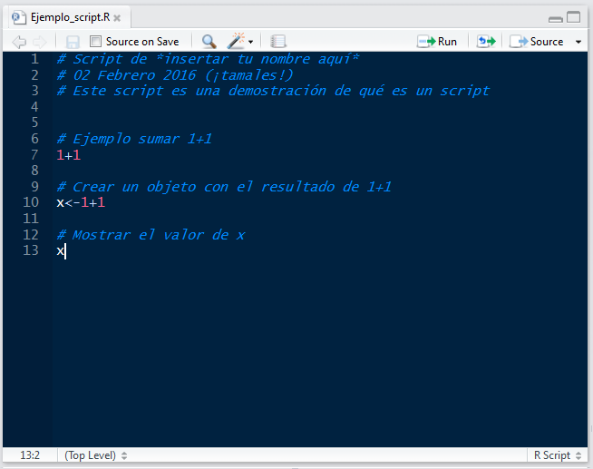

### ¿Qué es R?
* R es un lenguaje de programación y un ambiente de cómputo estadístico
* R es software libre (no dice qué puedes o no hacer con el software), de código abierto (todo el código de R se puede inspeccionar - y se inspecciona).
* Cuando instalamos R, instala la base de R. Mucha de la funcionalidad adicional está en **paquetes** que la comunidad crea.

### ¿Por qué R?
* R funciona en casi todas las plataformas (Mac, Windows, Linux e incluso en Playstation 3).
* R es un lenguaje de programación completo, permite desarrollo de DSLs (funciones muy específicas)
* R promueve la investigación reproducible: no sólo de análisis sino de cómo se hicieron las figuras.
* R está actualizado gracias a que tiene una activa comunidad. Solo en CRAN hay cerca de 8000 paquetes (funcionalidad adicional de R creadas creada por la 
comunidad).
* R se puede combinar con herramientas bioinformáticas y formatos de datos procesados (e.g. plink, vcf, etc) para realizar análisis y figuras.
* R tiene capacidades gráficas muy sofisticadas.
* R es popular como herramienta estadística ([la guerra del software](http://datacamp.wpengine.com/wp-content/uploads/2014/05/infograph.png))


### Descargar R y RStudio
Para comenzar se debe descargar [R](https://cran.r-project.org), esta descarga incluye R básico y un editor de textos para escribir código. Después de descargar R se recomienda descargar [RStudio](https://www.rstudio.com/products/rstudio/download/) (gratis y libre).

**RStudio** es un ambiente de desarrollo integrado para R: incluye una consola, un editor de texto y un conjunto de herramientas para administrar el espacio de trabajo cuando se  utiliza R. 


### ¿Cómo entender R?
* Hay una sesión de R corriendo. La consola de R es la interfaz entre R y nosotros. 
* En la sesión hay objetos. Todo en R es un objeto: vectores, tablas,  funciones, etc.
* Operamos aplicando funciones a los objetos y creando nuevos objetos.

##### La consola
Es una ventana que nos permite comunicarnos al motor de R. Esta ventana acepta **comandos** en el lenguaje de R y brinda una respuesta (resultado) a dichos comandos. 

La consola se distingue por tener el símbolo `>` seguido de un cursor parpadeante que espera a que le demos instrucciones (cuando recién abrimos R además muestra la versión que tenemos instalada y otra info).

Tu Consola debe verse más o menos así después del ejemplo anterior:


Por ejemplo, le podemos pedir a R que sume 1+1 así:

```
1+1
```    


##### Scripts 

Un **script** es un **archivo de texto plano** de nuestros análisis que es:

* permanente,
* repetible,
* anotado,
* compartible y 
* compatible con otras plataformas

Es decir lo mismo que escribiríamos en la Consola para hacer un análisis, pero guardado en un archivo de texto que tiene todos los comandos juntos y que podemos abrir para **repetir** o **compartir** el análisis.


Un script consta de dos tipos de texto: 

**1.** El **código** (comandos) que queremos que se ejecute, en el órden que queremos que lo ejecute.

**2.** Comentarios escritos **para un ser humano** en un **lenguaje de humanos**, dígase no solo en español, sino que nos permita entender qué hace el código, qué tipo de información requiere y cualquier otra cosa que una persona cualquiera necesite para poder utilizar el código del script de forma correcta.


Para que la computadora distinga entre el código y los comentarios para humanos se utiliza el símbolo `#`. Todo el texto a la *derecha* del símbolo `#` será ignorado por la computadora, aunque sí "se imprima" en la Consola.


Un script muy sencillo podría verse así:



"Ejemplo_script.R" es el nombre del archivo, es decir, que este texto es un **archivo de texto** (con terminación .R en vez de .txt) que vive en mi computadora.


##### Editor de scripts de RStudio

RStudio brinda además de la consola un editor de texto para **escribir scripts**, que es la pantalla que se observa en el ejemplo anterior. 

Lo que escribas en el editor de texto puede "enviarse" a la consola con los shortcuts de abajo o con el ícono correr. 

La idea es que en el editor de texto vayas escribiendo los comandos y comentarios de tu **script** hasta que haga exactamente lo que quieras. Todo lo que no haya funcionado debes borrarlo de tu script.


Algunos _shortcuts_ útiles en RStudio son:

**En el editor**  

* command/ctrl + enter: enviar código a la consola  
* ctrl + 2: mover el cursor a la consola

**En la consola**  

* flecha hacia arriba: recuperar comandos pasados  
* ctrl + flecha hacia arriba: búsqueda en los comandos  
* ctrl + 1: mover el cursor al editor  
* ?+nombre de función: ayuda sobre esa función.

#### Cómo citar R 

Citar R:

```
citation("base")
```

Citar un paquete en particular:

```
citation("NombrePaquete")
```
(o lo que loas autoreas especifiquen en su sitio web)
